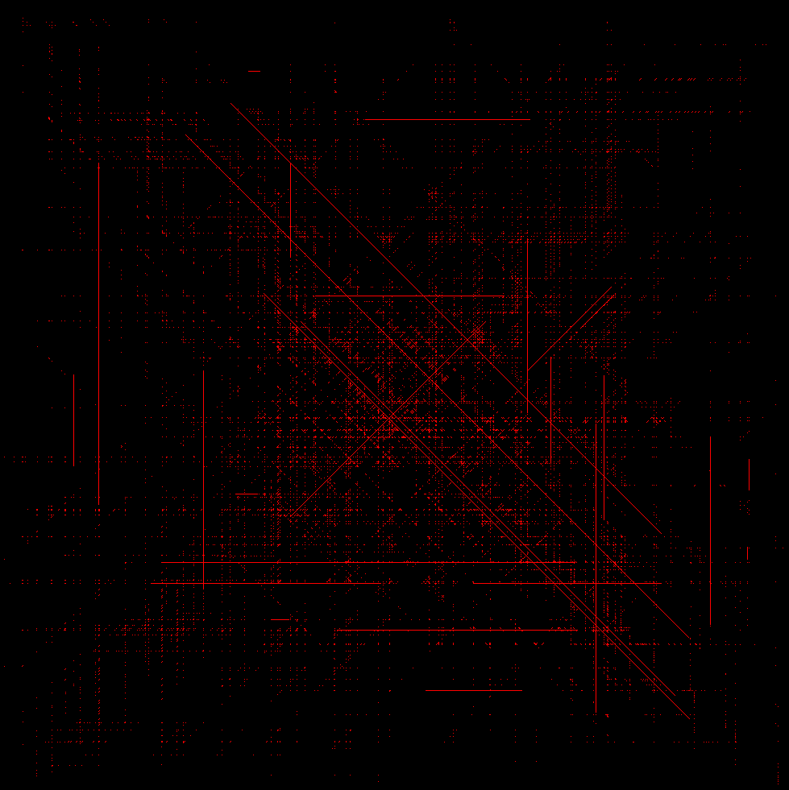
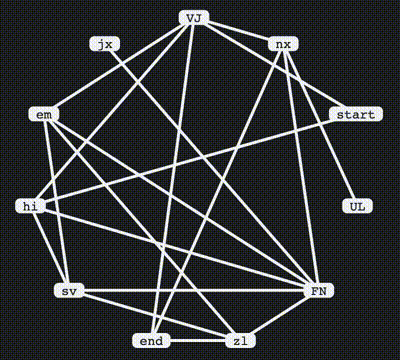
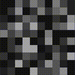

* [Day 4: Giant Squid\
​](day/4/)
* [Day 5: Hydrothermal Venture\
​](day/5/)
* [Day 8: Seven Segment Search\
​](day/8/)
* [Day 9: Smoke Basin\
​](day/9/)
* [Day 10: Syntax Scoring\
​](day/10/)
* [Day 11: Dumbo Octopus\
​](day/11/)
* [Day 12: Passage Pathing\
​](day/12/)
* [Day 13: Transparent Origami\
​](day/13/)
* [Day 14: Extended Polymerization\
​](day/14/)
* [Day 15: Chiton\
​](day/15/)
* [Day 16: Packet Decoder\
​](day/16/)
* [Day 17: Trick Shot\
​](day/17/)
* [Day 20: Trench Map\
​](day/20/)
* [Day 23: Amphipod\
](day/23/)
* [Day 25: Sea Cucumber\
](day/25/)